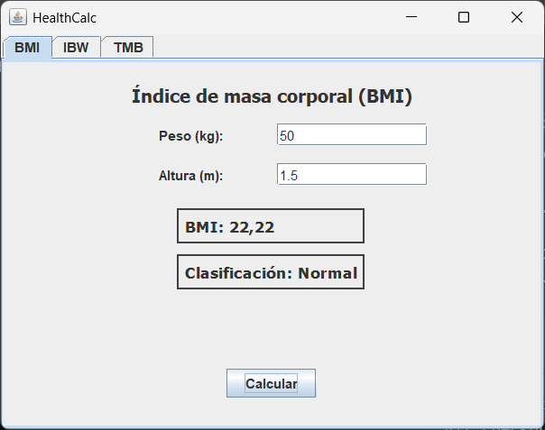
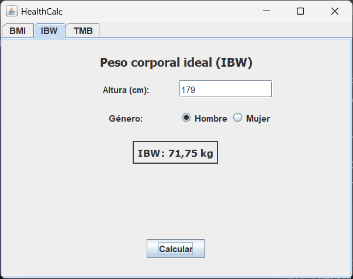
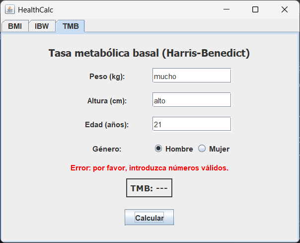
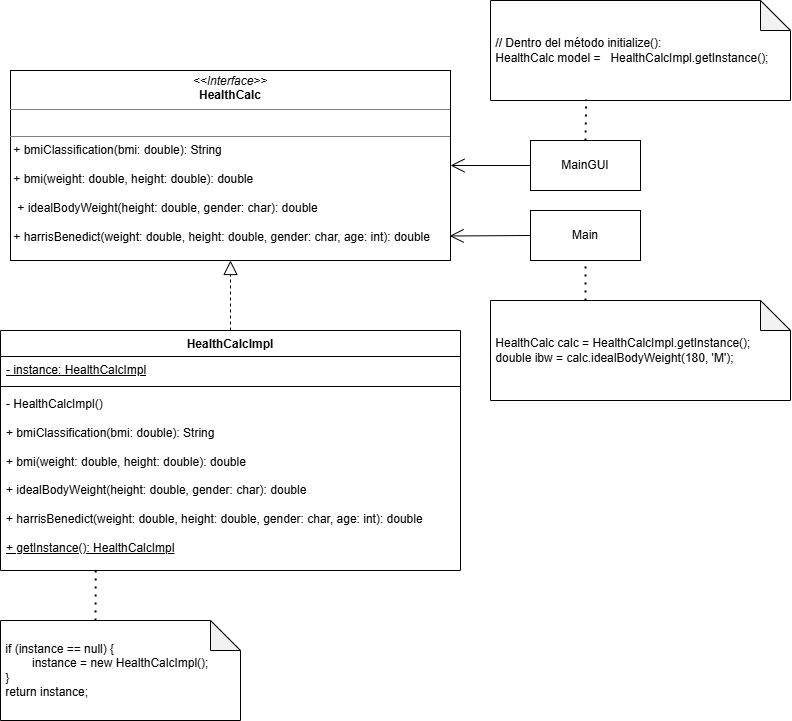
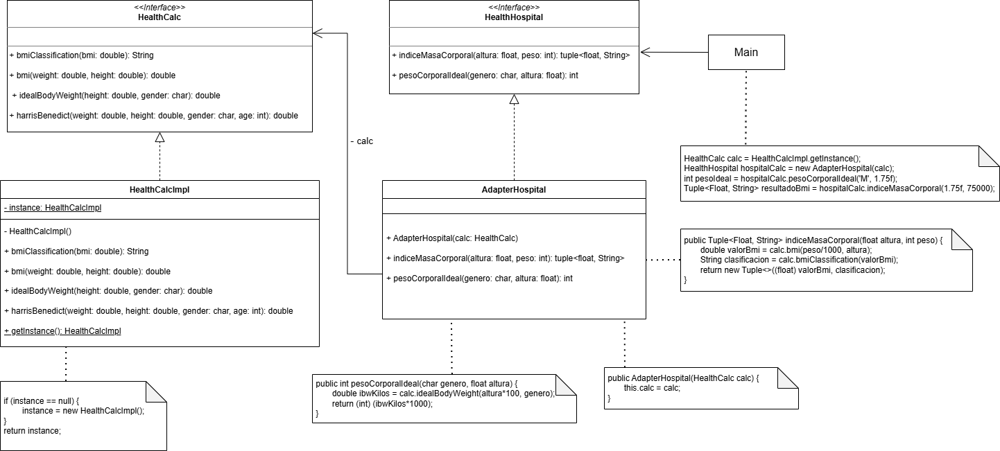
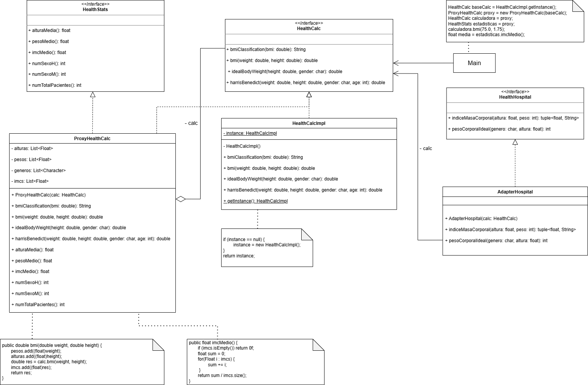
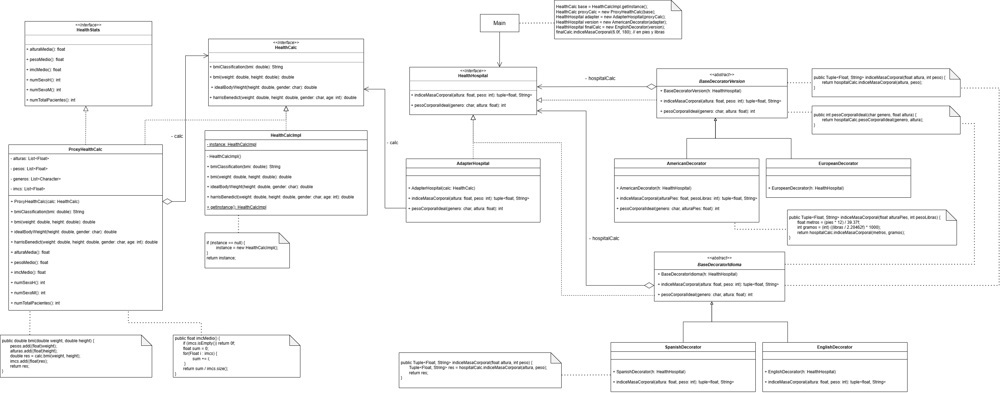

# HealthCalc
Bienvenido al proyecto de la asignatura de **Ingeniería del Software Avanzada**.

El [Hospital Universitario Virgen de la Victoria (El Clínico)](https://www.sspa.juntadeandalucia.es/servicioandaluzdesalud/hospital/virgen-victoria/) de Málaga nos ha encargado el desarrollo de una **Calculadora de Salud** (**_HealthCalc_**) que permita calcular diferentes métricas de los pacientes.

## Requisitos  

<b>Requisitos Funcionales</b>

- La calculadora debe dar soporte a al menos tres métricas.

<b>Requisitos No Funcionales</b>

Para que el proyecto cumpla con estándares de software médico, se deben incluir:
- **Gestión de Errores:** Manejo de excepciones en divisiones por cero (ej. altura 0 en IMC).
  1.  **Validación de Rangos (_Data Scrubbing_):**
      * *Hard Limits:* Bloquear entradas imposibles (ej. altura de 4 metros).
      * *Soft Limits:* Avisos ante valores inusuales pero posibles.
    
        > **Límites Biológicos Reales**:
            * **Altura:** El ser humano más alto registrado midió aproximadamente 272 cm. Un límite de 300 cm es un "Hard Limit" sensato.
            Un recién nacido puede medir 40cm. Un límite inferior sensato es de 30cm.
            * **Peso:** El peso máximo registrado ronda los 635 kg. Un límite de 700 kg sería el tope lógico.
            Un recién nacido puede pesar 2kg. Un límite inferior sensato es de 1kg.
  2.  **Soporte Multi-unidad:** Conversión automática entre sistema métrico (kg, cm) e imperial (lb, ft/in).
  3.  **Gestión de Errores:** Manejo de excepciones en divisiones por cero (ej. altura 0 en IMC).
- Todo el código de la aplicación (incluido los comentarios) deben estar en inglés.
- **Privacidad (_Compliance_):** Si el software almacena datos, debe considerar la anonimización de la Información Personal Identificable (PII) bajo normativas como GDPR o HIPAA.

## Métricas de HealthCalc

<b>Métricas Antropométricas</b>

* **M1: Índice de Masa Corporal (IMC) o _Body Mass Index (BMI)_:** El IMC es es un indicador estándar, adoptado por la [Organización Mundial de la Salud (OMS)](https://www.who.int/es), que evalúa la adecuación del peso de una persona en relación con su altura para estimar la grasa corporal.

    * **Fórmula:** $IMC = \frac{\text{peso (kg)}}{\text{altura (m)}^2}$

    El IMC nos permite clasificar el estado nutricional de una persona en categorías. La OMS ha definido la siguiente clasificación estándar del estado nutricional en adultos:

      - Bajo peso ($<18.5$)
      - Normal ($18.5-24.9$)
      - Sobrepeso ($25-29.9$)
      - Obesidad ($\ge 30$)

---

* **M2: Peso Corporal Ideal (PCI) o _Ideal Body Weight (IBW)_:** El PCI estima el peso teórico que se asocia con el menor riesgo de mortalidad y una mejor salud para un persona.

    Existen diferentes fórmulas para calcular el PCI:

    1. **Fórmula de Devine (1974)**
    Es la más extendida en entornos clínicos para ajustar dosis de medicamentos.

        - **Hombres:** 50 kg + [2.3 × (estatura en pulgadas - 60)]
        - **Mujeres:** 45.5 kg + [2.3 × (estatura en pulgadas - 60)]

    2. **Fórmula de Robinson (1983)**
    Es una variante de Devine más precisa, dando valores más bajos en mujeres y más altos en hombres. 

        - **Hombres:** 52 kg + [1.9 × (estatura en pulgadas - 60)]
        - **Mujeres:** 49 kg + [1.7 × (estatura en pulgadas - 60)]

    3. **Fórmula de Hamwi (1964)**
    Fórmula clásica utilizada por dietistas y nutricionistas debido a su sencillez.

        - **Hombres:** 48.1 kg + [2.7 × (estatura en pulgadas - 60)]
        - **Mujeres:** 45.4 kg + [2.2 × (estatura en pulgadas - 60)]

    4. **Fórmula de Lorentz (1929)**
    Es la fórmula más sencilla de aplicar manualmente ya que utiliza directamente la estatura en centímetros y no requiere conversiones a pulgadas.

        - **Hombres:** $PCI = (Estatura en cm - 100) - \frac{Estatura - 150}{4}$
        - **Mujeres:** $PCI = (Estatura en cm - 100) - \frac{Estatura - 150}{2}$

    **Nota:** Para convertir la estatura de **cm a pulgadas**, hay que dividir los centímetros entre **2.54**.

---

* **M3: Área de Superficie Corporal (ASC) o _Body Surface Area (BSA)_:** El ASC es una medida clínica utilizada para calcular dosis precisas de medicamentos, especialmente en quimioterapia y fluidos intravenosos, y para evaluar la severidad de quemaduras.

    La fórmula más común es la de **Mosteller**:

    * **Fórmula (Mosteller):** $BSA = \sqrt{\frac{\text{altura (cm)} \times \text{peso (kg)}}{3600}}$    

---

* **M4: Perímetro Abdominal (PA) o _Waist Circumference_ (WC):** Es la medición lineal de la circunferencia de la cintura. Se considera el indicador clínico directo de grasa visceral más sencillo y aceptado para predecir obesidad abdominal.
  
    * **Valores de Referencia (Riesgo Elevado):**  
      - **Hombres:** $\ge 94\text{ - }102 \text{ cm}$  
      - **Mujeres:** $\ge 80\text{ - }88 \text{ cm}$

---

* **M5: Índice de Cintura-Cadera (ICC) o _Waist-to-Hip Ratio_ (WHR):** Es ICC la relación entre el perímetro de la cintura y el de la cadera. Se utiliza para identificar la distribución de la grasa (cuerpo tipo "manzana" o "pera") y estimar el riesgo de enfermedades cardiovasculares.
  
    * **Fórmula:** $ICC = \frac{\text{Circunferencia de cintura (cm)}}{\text{Circunferencia de cadera (cm)}}$
    * **Valores de Riesgo (OMS):**  
        - **Hombres:** $> 0.90$  
        - **Mujeres:** $> 0.85$

    Tipos de Morfología:

    1.  **Cuerpo en forma de Manzana (Androide):**
        * **Definición:** La grasa se acumula principalmente en la zona abdominal (tronco).
        * **Implicación Clínica:** Mayor riesgo de hipertensión, diabetes tipo 2 y enfermedades cardíacas debido a la cercanía de la grasa a los órganos vitales (grasa visceral).
        * **Criterio:** Se asigna si el ICC supera los límites de la OMS (>0.90 en hombres, >0.85 en mujeres).

    2.  **Cuerpo en forma de Pera (Ginoide):**
        * **Definición:** La grasa se almacena mayoritariamente en la cadera, glúteos y muslos.
        * **Implicación Clínica:** Generalmente asociada a un menor riesgo metabólico que la forma de manzana, aunque puede relacionarse con problemas articulares o varices.
        * **Criterio:** Se asigna si el ICC está dentro de los rangos normales o bajos.

    | Sexo | Rango ICC | Categoría Morfológica | Riesgo de Salud |
    | :--- | :--- | :--- | :--- |
    | **Hombre** | $\le 0.90$ | Pera (Ginoide) | Bajo / Moderado |
    | **Hombre** | $> 0.90$ | **Manzana (Androide)** | **Alto** |
    | **Mujer** | $\le 0.85$ | Pera (Ginoide) | Bajo / Moderado |
    | **Mujer** | $> 0.85$ | **Manzana (Androide)** | **Alto** |

<b>Métricas Metabólicas y Nutricionales</b>

* **M6: Tasa Metabólica Basal (TMB) o _Basal Metabolic Rate (BMR)_:** El TMB calcula la cantidad mínima de energía (calorías) que el cuerpo necesita en reposo absoluto. 

    Existen diferentes fórmulas para calcular el PCI:

    1. **Ecuación de Mifflin-St Jeor**
    Es actualmente la más precisa para la población general y la que utilizan la mayoría de calculadoras modernas. 

        - **Hombres:**  `TMB = (10 × peso en kg) + (6.25 × altura en cm) - (5 × edad en años) + 5`
        - **Mujeres:**  `TMB = (10 × peso en kg) + (6.25 × altura en cm) - (5 × edad en años) - 161`

    2. **Ecuación de Harris-Benedict (revisada)**
    Es el método clásico. La versión original de 1919 fue revisada en 1984 por Roza y Shizgal para mejorar su exactitud.

        - **Hombres:**  `TMB = 88.362 + (13.397 × peso en kg) + (4.799 × altura en cm) - (5.677 × edad en años)`
        - **Mujeres:**  `TMB = 447.593 + (9.247 × peso en kg) + (3.098 × altura en cm) - (4.330 × edad en años)`

    3. **Ecuación de Katch-McArdle**
    A diferencia de las anteriores, esta fórmula no distingue entre sexos, sino que utiliza la Masa Corporal Magra (peso sin grasa). Es ideal si conoces tu porcentaje de grasa corporal.
        - `TMB = 370 + (21.6 × Masa Corporal Magra en kg)`
            > **Nota:** Masa Magra = Peso total × (1 - % de grasa decimal)

    4. **Ecuación de la OMS (FAO/WHO/UNU)**
    Utilizada a menudo en estudios de salud pública, divide el cálculo por rangos de edad específicos: 

        | Edad (Años) | Hombres | Mujeres |
        | :--- | :--- | :--- |
        | **18 – 30** | `(15.057 × peso) + 692.2` | `(14.818 × peso) + 486.6` |
        | **30 – 60** | `(11.472 × peso) + 873.1` | `(8.126 × peso) + 845.6` |
        | **> 60** | `(11.711 × peso) + 587.7` | `(9.082 × peso) + 658.5` |

---

* **M7: Gasto Energético Diario Total (GEDT) o _Total Daily Energy Expenditure (TDEE)_:** El TDEE es la cantidad total de calorías que el cuerpo quema en 24 horas. Suma el metabolismo basal (funciones vitales en reposo), la actividad física, la digestión y el movimiento cotidiano. Es esencial para ajustar la nutrición (perder, ganar o mantener peso).

    Para obtener las calorías totales que quemas al día, multiplica tu **TMB** por tu nivel de actividad:

    - **Sedentario** (poco/nada de ejercicio): `TMB × 1.2`
    - **Ligero** (ejercicio 1-3 días/semanas): `TMB × 1.375`
    - **Moderado** (ejercicio 3-5 días/semana): `TMB × 1.55`
    - **Fuerte** (ejercicio 6-7 días/semana): `TMB × 1.725`
    - **Muy fuerte** (atleta o trabajo físico pesado): `TMB × 1.9`

<b>Métricas Clínicas, Cardiovasculares, y de Función Orgánica</b>

Estas métricas requieren datos de signos vitales o resultados de laboratorio.

* **M8: Presión Arterial Media (PAM) o _Mean Arterial Pressure_ (MAP):** Representa la presión promedio en las arterias de un paciente durante un ciclo cardíaco completo. Se considera un mejor indicador de la perfusión (entrega de sangre) a los órganos vitales que la presión sistólica por sí sola. Un valor mínimo de 60-65 mmHg es necesario para mantener los órganos sanos.
  
    **Fórmula:** $PAM = \frac{PAS + 2(PAD)}{3}$  
    *(Donde PAS = Presión Arterial Sistólica y PAD = Presión Arterial Diastólica)*.

--- 

* **M9: Índice de Adiposidad Visceral (VAI) o _Visceral Adiposity Index_ (VAI):** Es un indicador empírico que estima la función del tejido adiposo visceral y el riesgo cardiometabólico. Combina medidas físicas (IMC y CC) con parámetros lipídicos (Triglicéridos y HDL).
  
    **Fórmulas:**  
        - **Hombres:** $VAI = \left( \frac{CC}{39.68 + (1.88 \times IMC)} \right) \times \left( \frac{TG}{1.03} \right) \times \left( \frac{1.31}{HDL} \right)$  
        - **Mujeres:** $VAI = \left( \frac{CC}{36.58 + (1.89 \times IMC)} \right) \times \left( \frac{TG}{0.81} \right) \times \left( \frac{1.52}{HDL} \right)$  
    *(Donde CC = Circunferencia de Cintura en cm, TG = Triglicéridos y HDL en mmol/L)*.

--- 

* **M10: Tasa de Filtración Glomerular Estimada (eGFR) o _Estimated Glomerular Filtration Rate_ (eGFR):** Es el "estándar de oro" para evaluar qué tan bien están filtrando la sangre los riñones. Es vital para la detección de la Enfermedad Renal Crónica (ERC) y para ajustar dosis de fármacos.
  
    **Fórmulas Comunes:**  
      * **Cockcroft-Gault (Clásica):** $\frac{(140 - \text{edad}) \times \text{peso}}{72 \times \text{creatinina}} \times (0.85 \text{ si es mujer})$.  
      * **CKD-EPI (Moderna):** Utiliza logaritmos y variables de raza/sexo para mayor precisión (es la recomendada actualmente en software clínico).  
    * **Entradas necesarias:** Creatinina sérica (mg/dL), edad, sexo y etnia.  

--- 

* **M11: Escala NEWS2 o _National Early Warning Score 2_:** Es un sistema de puntuación estandarizado para detectar el deterioro clínico agudo en pacientes adultos. En lugar de una fórmula aritmética simple, es un **sistema de puntos acumulativo** basado en rangos fisiológicos.
  
    **Parámetros Evaluados (7):**
      1. Frecuencia respiratoria.
      2. Saturación de oxígeno.
      3. Uso de oxígeno suplementario (Sí/No).
      4. Presión arterial sistólica.
      5. Frecuencia cardíaca (Pulso).
      6. Nivel de conciencia (Escala ACVPU).
      7. Temperatura.
    * **Lógica de Software:** El sistema suma puntos (0 a 3) por cada parámetro que se desvíe de lo normal. Un puntaje de 5 o más es una "Alerta Roja" que requiere respuesta urgente.

## Plan de pruebas

Para garantizar que la calculadora sea fiable y segura, se han definido los siguientes casos de prueba divididos por categorías:

<b>Pruebas de Cálculo del Índice de Masa Corporal (IMC o BMI)</b>

* **Cálculo correcto:** Se comprueba que, al introducir un peso y altura normales, el resultado sea el esperado matemáticamente.
* **Protección ante datos imposibles:**
    * El sistema debe rechazar pesos menores a 1 kg o mayores a 700 kg.
    * El sistema debe rechazar alturas menores a 30 cm o mayores a 300 cm.
* **Protección ante errores de escritura:** Se verifica que no se permitan valores negativos o iguales a cero.

<b>Pruebas de Clasificación del Estado de Salud basado en el IMC/BMI</b>

Para cada categoría, probamos valores que están justo en el límite para asegurar que el cambio de etiqueta es exacto:  

* **Delgadez severa (Severe Thinness):** Se comprueba con valores por debajo de 16.
* **Delgadez moderada (Moderate Thinness):** Se comprueba con valores desde 16 hasta justo antes de 17.
* **Delgadez leve (Mild Thinness):** Se comprueba con valores desde 17 hasta justo antes de 18.5.
* **Peso normal (Normal):** Se comprueba con valores desde 18.5 hasta justo antes de 25.
* **Sobrepeso (Overweight):** Se comprueba con valores desde 25 hasta justo antes de 30.
* **Obesidad Clase I (Obese Class I):** Se comprueba con valores desde 30 hasta justo antes de 35.
* **Obesidad Clase II (Obese Class II):** Se comprueba con valores desde 35 hasta justo antes de 40.
* **Obesidad Clase III (Obese Class III):** Se comprueba con valores desde 40 en adelante.
* **Seguridad:** Se rechazan clasificaciones para resultados de IMC negativos o absurdamente altos (más de 150).

<b>Pruebas de la BMR (métrica Harris-Benedict)</b>

* **Cálculo correcto para hombres:** Se comprueba que, al introducir peso, altura y edad válidos para un hombre, el resultado coincida con la fórmula de Harris-Benedict.
* **Cálculo correcto para mujeres:** Se comprueba que, al introducir peso, altura y edad válidos para una mujer, el resultado coincida con la fórmula de Harris-Benedict.
* **Protección ante género inválido:** Se debe lanzar un error con géneros distintos a 'M' o 'W'.
* **Protección ante datos imposibles:**
    * Se debe rechazar edades negativas o superior al límite razonable (por ejemplo más de 120 años).
    * Se debe rechazar pesos fuera de un rango razonable (menores a 1 kg o mayores a 700 kg).
    * Se debe rechazar alturas fuera de un rango razonable (menores a 30 cm o mayores a 300 cm).

<b>Pruebas de Cálculo del Peso Corporal Ideal (IBW) - Lorentz</b>

* **Cálculo correcto (Hombres):** Se comprueba que, al introducir una altura normal (ej. 170 cm o 180 cm), el resultado coincida con la fórmula de Lorentz para hombres.
* **Cálculo correcto (Mujeres):** Se comprueba que, al introducir una altura normal (ej. 160 cm o 170 cm), el resultado coincida con la fórmula de Lorentz para mujeres.
* **Protección ante género inválido:** El sistema debe rechazar cualquier carácter que no sea 'M' (Hombre) o 'W' (Mujer), lanzando una excepción.
* **Protección ante datos imposibles:** El sistema debe rechazar alturas menores a 30 cm o mayores a 300 cm (límites biológicos), al igual que valores negativos o cero, lanzando una excepción.

## Instalación y ejecución

<b>Python</b>

### Dependencias
- Python 3.13+
- pytest
- coverage
- pytest-cov

### Preparación del entorno
1. Clonar este repositorio: `git clone https://github.com/IngSoftAvanz/healthcalc.git`
2. Desplazarse a la carpeta del proyecto:
   `cd healthcalc/python-project-healthcalc`
3. Crear entorno virtual: `python -m venv env` (esto crea una carpeta `env` para el entorno virtual)
4. Activar el entorno virtual:
    - En Windows: `.\env\Scripts\Activate`
    - En Linux: `. env/bin/activate`
5. Instalar dependencias: `pip install -r requirements.txt`

### Ejecución
- Ejecutar la aplicación: `python main.py <número>`
- Ejecutar los tests: `pytest -v`
- Ejecutar los tests con informe de cobertura: `pytest -v --cov=factorial --cov-report=html tests/`

<b>Java</b>

### Dependencias
- Java JDK 18+
- Maven
- JUnit
- Jacoco
  
### Preparación del entorno
1. Clonar este repositorio: `git clone https://github.com/IngSoftAvanz/healthcalc.git`
2. Desplazarse a la carpeta del proyecto:
   `cd healthcalc/java-project-healthcalc`
3. Compilar con Maven: `mvn clean compile`

### Ejecución
- Ejecutar la aplicación: Clic en Run usando el IDE.
- Ejecutar los tests: Clic en Run Tests usando el IDE o con Maven: `mvn test`
- Ejecutar los tests con informe de cobertura (previamente configurado en pom.xml): `mvn test`

## Interfaz gráfica de usuario (GUI)

### Ejecución de la aplicación
Para probar la calculadora sin necesidad de abrir el entorno de desarrollo:
1. Localiza el archivo `HealthCalc_grupo03.jar` en la raíz de este repositorio.
2. Descarga ese archivo y haz doble clic. Si tienes Java instalado, se ejecutará directamente.
3. Si prefieres la consola, puedes usar el comando: `java -jar HealthCalc_grupo03.jar`

<b>Vistas de la calculadora</b>

### Índice de masa corporal (BMI)

---

### Peso corporal ideal (IBW - Fórmula de Lorentz)

---

### Tasa metabólica basal (TMB - Harris-Benedict)

## Práctica 6: Patrones de diseño

### 1. Patrón Singleton 
* **Problema:** Garantizar que la calculadora de salud no se instancie múltiples veces innecesariamente y comparta un único estado global.
* **Solución:** Se ha modificado `HealthCalcImpl` ocultando su constructor (`private`) y añadiendo un método de acceso global estático `getInstance()`. De esta forma, tanto el entorno de consola como la interfaz gráfica consumen exactamente la misma instancia única.
* **Diagrama UML:**
  

### 2. Patrón Adapter 
* **Problema:** Integrar nuestra calculadora con la interfaz externa `HealthHospital` suministrada por el hospital Costa del Sol, la cual utiliza una firma distinta (devuelve tuplas) y unidades incompatibles con nuestra calculadora (altura en metros y peso en gramos).
* **Solución:** Se ha creado la clase `AdapterHospital` que implementa `HealthHospital`. Esta actúa como "traductora", recibiendo los metros y gramos del hospital, transformándolos internamente a centímetros y kilogramos para invocar a nuestra calculadora, y empaquetando el resultado en un objeto genérico `Tuple`.
* **Diagrama UML:**
  

### 3. Patrón Proxy 
* **Problema:** Llevar un registro e historial de uso clínico de forma anónima capturando los datos introducidos por los pacientes y calculando medias globales a través de la interfaz `HealthStats`, sin alterar el código de la calculadora original ni del adaptador del hospital.
* **Solución:** Se ha diseñado un proxy de registro (`ProxyHealthCalc`) que implementa simultáneamente `HealthCalc` y `HealthStats`. El proxy se coloca de manera intermedia mediante una relación de agregación, intercepta silenciosamente las llamadas a los métodos de cálculo para almacenar las variables en listas locales y, posteriormente, delega el cálculo real en la instancia original.
* **Diagrama UML:**
  

### 4. Doble Patrón Decorator
* **Problema:** Añadir dinámicamente y de forma encadenada nuevas responsabilidades a la plataforma del hospital (`HealthHospital`), permitiendo disponer de versiones con conversiones de unidades americanas (pies y libras) y europeas, combinadas de forma flexible con mensajes personalizados bilingües (inglés y español).
* **Solución:** Siguiendo el esquema UML final, se ha implementado una estructura de doble Decorator heredando secuencialmente de la interfaz del hospital:
  * **Decoradores de Versión (`BaseDecoratorVersion`, `AmericanDecorator`, `EuropeanDecorator`):** Interceptan los datos en formatos como pies y libras, los convierten al sistema métrico correspondiente y los envían hacia abajo en la cadena.
  * **Decoradores de Idioma (`BaseDecoratorIdioma`, `SpanishDecorator`, `EnglishDecorator`):** Extienden las funcionalidades de salida formateando y traduciendo las respuestas de clasificación al idioma seleccionado.
* **Diagrama UML combinado final:**
  

## Práctica 7: Refactorings

A continuación se detallan los 5 refactorings aplicados al proyecto para adaptar la arquitectura al nuevo diagrama y resolver diversos *bad smells*:

### Refactoring 1. Sustitución de tipos primitivos 
* (1) Bad smell: Primitive Obsession (obsesión por los primitivos).
* (2) Refactoring: Replace Type Code with Enum.
* (3) Categoría: Class refactoring.
* (4) Descripción: Sustituimos los tipos primitivos que representaban el género y la clasificación (char y String) por enumerados (Gender y BMICategory).
* (5) Cambios manuales: 2 archivos nuevos creados (Gender.java y BMICategory.java).

### Refactoring 2. Encapsulación de datos del paciente
* (1) Bad smell: Data Clumps/Long Parameter List (grupos de datos y lista larga de parámetros).
* (2) Refactoring: Introduce Parameter Object/Extract Class.
* (3) Categoría: Class refactoring.
* (4) Descripción: Extraemos los datos del paciente (peso, altura, edad, género) a una nueva interfaz Person y su implementación Patient para encapsular la información.
* (5) Cambios manuales: 2 archivos nuevos creados (Person.java y Patient.java).

### Refactoring 3. Segregación de interfaces 
* (1) Bad smell: Large Class/Fat Interface (interfaz gorda).
* (2) Refactoring: Extract Interface.
* (3) Categoría: Class refactoring.
* (4) Descripción: Eliminamos la interfaz HealthCalc y la segregamos en tres interfaces independientes (BodyMassIndex, IdealBodyWeight y BasalMetabolicRate) para cumplir el Principio de Segregación de Interfaces (ISP).
* (5) Cambios manuales: 4 archivos modificados (eliminada la interfaz HealthCalc y creadas las 3 nuevas interfaces).

### Refactoring 4. Inyección de dependencias mediante objetos
* (1) Bad smell: Long Parameter List (lista larga de parámetros).
* (2) Refactoring: Preserve Whole Object.
* (3) Categoría: Method refactoring.
* (4) Descripción: Modificamos las firmas de los métodos en HealthCalcImpl y en todas las clases que los llaman para que reciban el objeto Person en lugar de los parámetros sueltos.
* (5) Cambios manuales: Cambios manuales: 11 archivos modificados (HealthCalcImpl, los tres controladores del MVC, el proxy, el adapter, los tres archivos de tests y los dos main -consola e interfaz-).

### Refactoring 5. Estandarización de nomenclatura
* (1) Bad smell: Uncommunicative Name (nombres poco comunicativos).
* (2) Refactoring: Rename Method.
* (3) Categoría: Method refactoring.
* (4) Descripción: Renombramos los métodos (ej. bmi a bodyMassIndex, harrisBenedict a basalMetabolicRate) para estandarizarlos y reflejar la nomenclatura correcta.
* (5) Cambios manuales: 1 archivo modificado en sus firmas (HealthCalcImpl.java), además de las llamadas en los tests.